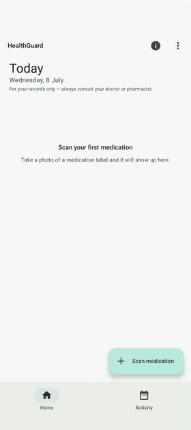
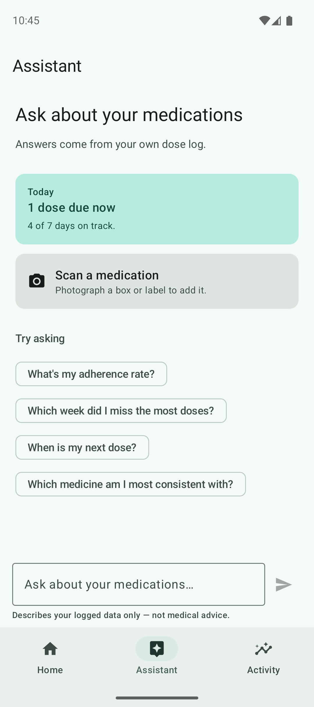
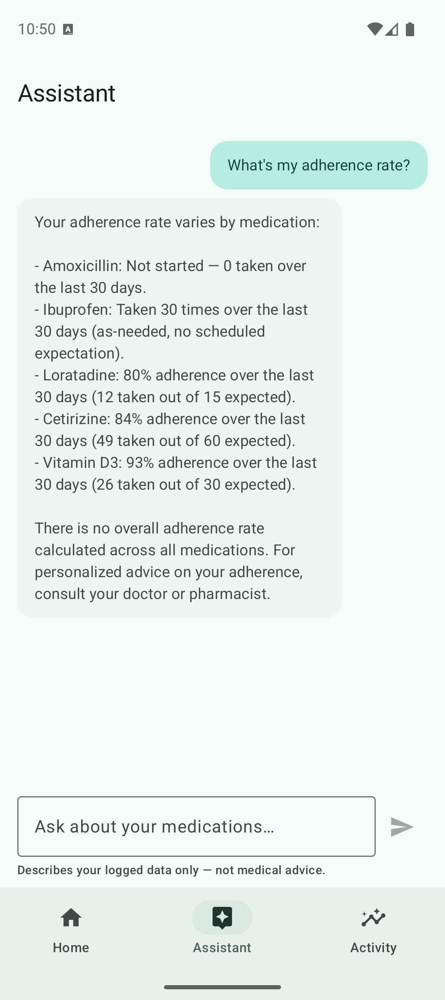
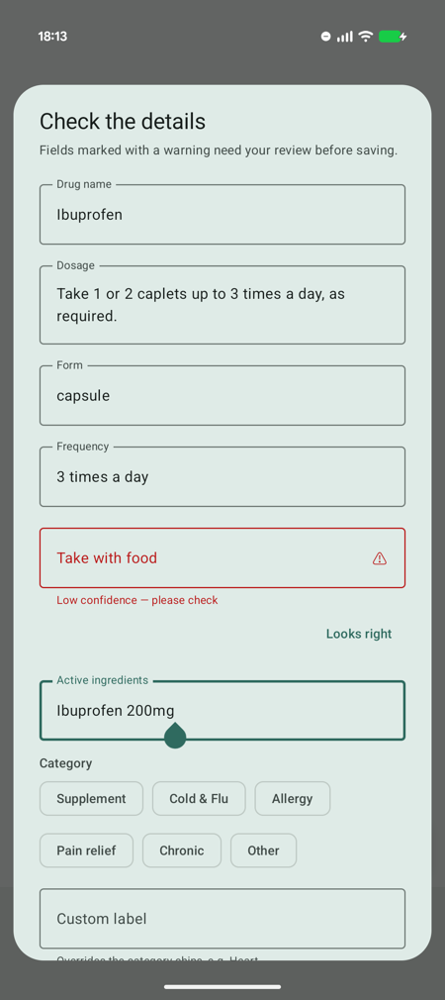
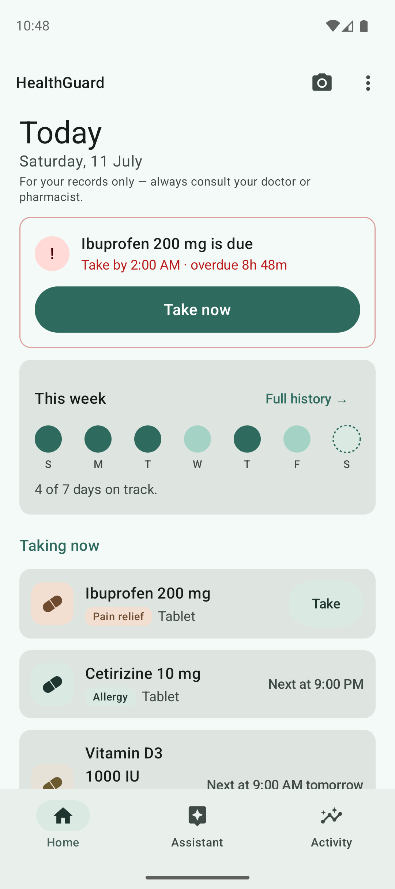
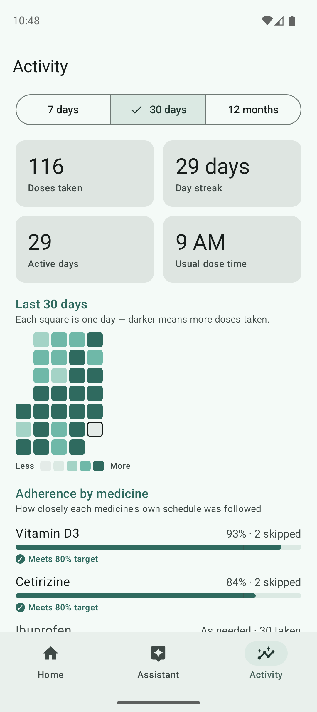
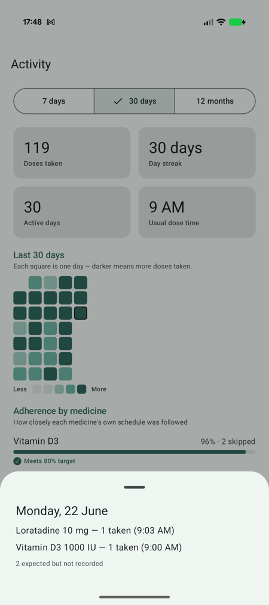
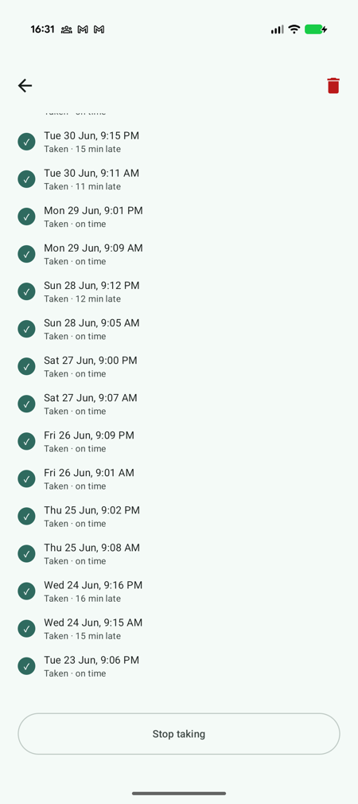
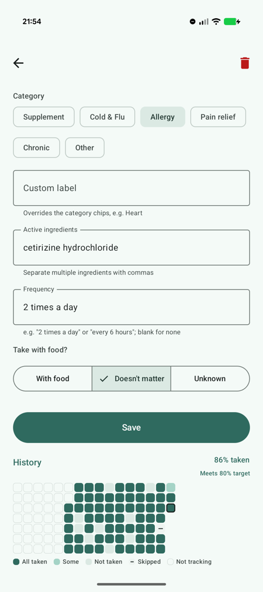

# HealthGuard

Android medication tracker with AI label scanning.

- Photograph a medication box — a vision LLM extracts name, dosage, form,
  ingredients and frequency into a dosing schedule
- One-tap dose logging with undo and a double-dose guard
- GitHub-style activity heat map and schedule-based adherence analytics
- Assistant-first design: the landing screen is an assistant hub — today's
  status at a glance, scan entry, and adherence questions answered in plain
  English ("What's my adherence rate?"). The app computes the numbers, the
  model only phrases them. Home and Activity sit one tap away on the nav bar
- Kotlin Multiplatform app + Ktor backend

> **HealthGuard is an informational and reminder tool, not medical advice.**
> It never makes medical judgements. Always consult your doctor or pharmacist.

## Demo

Scan a label → confirm the extracted fields → take a dose → it lands in the
record (2× speed; [full-quality video](docs/demo/scan-take-record.mp4)):



## Screenshots

| Assistant | Ask a question |
|---|---|
|  |  |
| The landing screen: today's status at a glance, scan entry, and starter questions. | Answers phrase the app's own adherence math — never invented numbers, never medical advice. |

| Scan | Home |
|---|---|
|  |  |
| Extraction from a real ibuprofen box — the low-confidence "take with food" field is locked until reviewed. | Due alert only when a dose is due; week circles with an honest "4 of 7 days on track"; scan lives on the camera action. |

| Activity | Tap a day |
|---|---|
|  |  |
| The 30-day record, GitHub-style, plus each medicine's own adherence with the 80% clinical threshold marked. | Per-day breakdown — which medicines, what times, and what was expected but never recorded. |

| Medication detail | Dose history |
|---|---|
|  |  |
| Live countdown to the next dose, last-taken time, meal-aligned dose times. | Every dose annotated: on time, 12 min late, skipped, missed, or not recorded. |

## How it works

```
┌──────────────┐  photo (base64)  ┌────────────────┐  forced JSON schema  ┌────────────┐
│  Android app │ ───────────────► │  Ktor backend  │ ───────────────────► │ OpenRouter │
│  (Compose)   │ ◄─────────────── │  (proxy, holds │ ◄─────────────────── │  Qwen VL   │
└──────────────┘  extraction JSON │   the API key) │                      └────────────┘
```

- Photo is downscaled on the phone, sent to the Ktor backend, forwarded to a
  vision model (`qwen/qwen2.5-vl-72b-instruct` via OpenRouter — just a config
  value, any vision model works).
- The model must answer in a fixed JSON schema: drug name, dosage, form,
  ingredients, frequency, with-food — each with a confidence score.
- **The model only transcribes, it never decides anything.** Its output is
  treated as untrusted input:
  - the parser survives garbage JSON, NaN confidences and hallucinated
    frequencies like "3,000,000 times a day" — everything degrades to
    "please check this field", never a crash or a bad save
  - low-confidence fields are locked until the user confirms or corrects them
- Everything safety-related — dose timing, the double-dose warning, the
  adherence maths — is plain deterministic Kotlin with tests.

## Architecture

Clean Architecture with a compiler-enforced module graph and a full MVI
presentation layer.

```
┌───────────────────────────── :app (Android) ─────────────────────────────┐
│  Package-by-feature: home / detail / confirm / activity                  │
│  Each feature owns its MVI set (composables under <feature>/ui):         │
│    Intent (sealed) ─► ViewModel.onIntent ─► UiState / Effect ─► Screen   │
│    + UiStateMapper (domain content → view state)                         │
└──────────────┬────────────────────┬───────────────────────────────────────┘
               │                    │ depends on use cases only
┌──────────────▼───────────────┐    │
│  :core:ui — shared theme,    │    │
│  components, formatters      │    │
└──────────────┬───────────────┘    │
┌──────────────▼────────────────────▼───────────────────────────────┐
│  :core:domain — Kotlin Multiplatform, pure                        │
│  entities · use cases · repository interface · dose/adherence     │
│  maths · extraction contracts                                     │
└───────────────────────────────────▲───────────────────────────────┘
                        implemented by
┌───────────────────────────────────┴───────────────────────────────┐
│  :core:data — KMP: SQLDelight repository, Ktor vision extractor   │
└───────────────────────────────────────────────────────────────────┘
```

Layering rules, enforced by module boundaries:

- Presentation depends on **use cases only** — no ViewModel references the
  repository; every read and write goes through a named use case
  (`RecordDoseUseCase`, `ComputeHomeStateUseCase`, `ObserveMedicationsUseCase`, …).
- `:core:domain` is framework-free — no Android, no `java.*`, no hardcoded
  dispatchers, IDs via `kotlin.uuid` — so it compiles for any KMP target
  (iOS-ready by construction).
- `:core:data` implements the domain interfaces
  (`SqlDelightMedicationRepository`, `ProxyVisionExtractor`); it is the only
  layer that touches the database or the network.

MVI, per feature (no shared base class — each feature is self-contained):

- **Intent** — a sealed hierarchy of every user action, dispatched through a
  single `onIntent(intent)` entry point.
- **UiState** — one immutable view state per screen; state recomputes from
  domain content and carries the wall-clock instant it was computed at, so
  countdowns and "overdue" text can never drift from the underlying facts.
- **Effect** — one-shot events (snackbars, navigation results) on a buffered
  channel with a single consumer; never modelled as state, so they cannot
  re-fire on rotation.
- **UiStateMapper** — the only place domain models are converted to view
  models; formatting (dates, captions, row status) lives here and in
  per-feature `*Format` files, never in the domain.

Cross-cutting choices:

- Domain logic is pure functions — clock and timezone always injected, which
  is how DST transitions and half-hour timezones got real tests.
- Dose times are meal-aligned (9 AM, 9 PM, …) — never between 22:00 and
  08:00.
- Every write goes through role-segregated repository interfaces
  (`MedicationRepository` / `DoseLogRepository`) that broadcast changes; the
  `ObserveMedicationsUseCase` folds that signal into the medication stream so
  every screen updates after every action.
- Ids are value classes (`MedicationId`, `ScheduleId`, `DoseId`) — passing
  the wrong id to a repository or use case does not compile.

## Tech stack

| Area | Choice |
|---|---|
| Language | Kotlin 2.2 — Multiplatform (`android` + `jvm` targets) |
| UI | Jetpack Compose, Material 3 |
| Architecture | Clean Architecture · MVI · package-by-feature |
| Dependency injection | Koin (single composition root in `:app`) |
| Persistence | SQLDelight (typed SQL, multiplatform drivers) |
| Networking | Ktor client (app ↔ proxy), Ktor server (backend) |
| Async | Kotlin coroutines + Flow (`StateFlow` view state, `Channel` effects) |
| Serialization / time | kotlinx.serialization · kotlinx-datetime · `kotlin.time` |
| Testing | kotlin.test + JUnit 4, in-memory SQLite, coroutines-test |
| Build | Gradle version catalogs, AGP 9, JDK 21 toolchain (17 bytecode), GitHub Actions CI |

## Modules

| Module | What it is |
|---|---|
| `app/` | Android presentation — feature packages with MVI ViewModels, mappers, and screens, plus the Koin composition root |
| `core/ui/` | Shared presentation library — theme, reusable Compose components (heat maps, chips, dialogs), shared formatters, previews |
| `core/domain/` | Pure Kotlin Multiplatform — entities, use cases, repository interface, dose scheduling and adherence maths |
| `core/data/` | KMP data layer — SQLDelight repository implementation, vision-extraction and chat clients |
| `backend/server/` | Small Ktor server with two endpoints (`/extract`, `/chat`). It exists so the API key never ships inside the app |

## How adherence is counted

- Percentages are measured against the **schedule**, not against whatever got
  logged — ignore the app for three days and those days count as gaps instead
  of disappearing from the maths.
- Same taxonomy clinicians use (initiation / implementation / persistence):
  - never started → labelled "Not started", kept out of the stats
  - stopped → reports "% while taking"
  - deliberately skipped ≠ forgot: skips are shown separately, not punished
  - "every 6 hours" is a maximum, not an obligation → tracked as-needed, no
    3am phantom doses
- The 80% line on the bars is the threshold most adherence research uses.

## Testing

- 380+ tests across the five modules, written test-first.
- Highest-value suites:
  - parser boundary tests — the LLM is an adversary as far as the parser is
    concerned
  - dose-time maths across DST changes and odd timezones
  - use-case tests against an in-memory fake repository that mirrors the
    real SQL semantics
  - ViewModel tests against a real in-memory database, not mocks — driven
    through the MVI `onIntent` surface and asserted on state and effects
- CI runs everything plus lint on every push.

## Privacy

- Health data stays on the device — no account, no cloud sync.
- Photos go to the model provider for extraction and nowhere else; the
  backend never stores or logs them.
- Chat works the same way: an adherence snapshot travels with each question
  and is never stored or logged off-device. Conversations live in memory
  only and vanish when the app process ends. The assistant reports your
  data; it never gives medical advice.
- Deleting a medication wipes its whole history.

## Prerequisites

- **JDK 21** (the build pins the Gradle daemon toolchain to 21; bytecode targets 17)
- **Android Studio** (latest stable) with an emulator image or a physical Android device (Android 7.0+, API 24)
- An **OpenRouter API key** — sign up at [openrouter.ai](https://openrouter.ai), create a key under *Keys*, and add a small amount of credit. A label scan with the default model (`qwen/qwen2.5-vl-72b-instruct`) costs a fraction of a cent. Setting a monthly spend limit on the key is recommended.

## 1. Start the backend server

The app cannot extract anything without the backend running.

Create `backend/server/.env` (git-ignored) containing your key:

```
OPENROUTER_API_KEY=sk-or-v1-...
```

The `run` task loads that file automatically, so starting the server is just:

```bash
./gradlew :backend:server:run
```

**From Android Studio instead of a terminal:** open the Gradle tool window
(the elephant icon, right edge) → `HealthGuard → backend → server → Tasks →
application → run` and double-click it. Android Studio adds it to the run
configuration dropdown next to ▶, so from then on you can start the backend
with the Run button and stop it with the red ■ — no terminal needed. (A
ready-made "backend server" run configuration may already appear in the
dropdown after a project reload.)

An environment variable still wins over `.env` if you prefer:
`OPENROUTER_API_KEY=sk-or-v1-... ./gradlew :backend:server:run`

Optional model overrides (env or `.env`): `MODEL_ID` for `/extract`
(default `qwen/qwen2.5-vl-72b-instruct`), `CHAT_MODEL_ID` for `/chat`
(default `qwen/qwen3-30b-a3b-instruct-2507`).

**Stopping the server:**

- Started from Android Studio → press the red ■ stop button.
- Started from a terminal → `Ctrl-C` in that terminal.
- Lost track of it (e.g. a closed terminal left it running) →
  `lsof -ti :8787 | xargs kill`

Only one instance can hold port 8787 — if a start fails with
`Address already in use`, stop the previous instance first.

Success looks like:

```
INFO io.ktor.server.Application -- Application started ...
```

The server listens on **port 8787** and keeps running until you press `Ctrl-C`.
Optional environment variables: `PORT` (default 8787), `MODEL_ID` (default
`qwen/qwen2.5-vl-72b-instruct` — any vision-capable OpenRouter model id works).

**"Address already in use"?** A previous server instance is still holding the
port. Free it and start again:

```bash
lsof -ti :8787 | xargs kill
```

Quick health check (404 is the expected answer for the root path):

```bash
curl -i http://localhost:8787/
```

## 2. Run the app

Open the project in Android Studio, let Gradle sync, and pick **one** of the
three setups below depending on where the app will run. The app finds the
backend through one line in `local.properties` (a git-ignored file in the
repository root that Android Studio creates automatically).

### Option A — Emulator (zero configuration)

Nothing to configure. Inside an emulator, the special address `10.0.2.2`
means "the host machine", and that is the debug build's default.

1. Start the backend (step 1).
2. Select an emulator and press **Run ▶**.

### Option B — Real device over USB

The phone reaches your computer through an adb port tunnel — works even
without Wi-Fi.

1. Enable *Developer options* → *USB debugging* on the phone and plug it in.
2. Add this line to `local.properties`:

   ```properties
   healthguard.proxyBaseUrl=http://127.0.0.1:8787
   ```

3. Create the tunnel (re-run this any time the phone is re-plugged, rebooted,
   or adb restarts — it drops silently):

   ```bash
   adb reverse tcp:8787 tcp:8787
   ```

4. Start the backend (step 1), select the device, press **Run ▶**.

### Option C — Real device over Wi-Fi

The phone talks to your computer directly; both must be on the **same
Wi-Fi network**.

1. Find your computer's LAN IP:
   - macOS: `ipconfig getifaddr en0`
   - Linux: `hostname -I`
   - Windows: `ipconfig` (IPv4 address)
2. Add it to `local.properties`:

   ```properties
   healthguard.proxyBaseUrl=http://192.168.1.42:8787   # use YOUR IP
   ```

3. Start the backend (step 1), select the device, press **Run ▶**.
4. If your OS firewall prompts about incoming connections for Java, allow it.

Note: routers reassign IPs from time to time — if extraction stops working
after a few days, re-check the IP and update `local.properties`.

> Debug builds allow plain-HTTP traffic so these local setups work; release
> builds block cleartext entirely and expect an HTTPS backend URL.

## 3. Try the flow

1. **Import medication** → *Take photo* or *Choose from gallery* → aim at a
   medication box or label.
2. Watch *Reading label…* — the photo goes through the backend to the vision
   model.
3. The review dialog shows the extracted fields. Anything the model was not
   confident about is highlighted and must be confirmed or corrected before
   **Accept** unlocks. Add an optional label (e.g. *hay fever*) if you like.
4. Accept — the medication appears in the home list.
5. Press **▶** on a cabinet row to mark it as actively taking; it moves up
   into *Taking now* with its next dose on the row. Open a medication for
   the full detail page — take a dose, stop taking, or delete it there.

No backend running? The app degrades gracefully to
*"Service unavailable — check connection"* with a Retry button.

**How adherence is measured:** percentages compare doses you took against
what the schedule expected — so days with no records count as gaps rather
than disappearing from the maths. Doses you deliberately skip are left out
of the target and shown separately. "Every N hours" medicines have no fixed
daily target (labels state a maximum, not an obligation), so they are shown
as *as-needed* counts instead of a percentage. The 80% guideline mirrors the
threshold commonly used in clinical adherence research.

## Running the tests

```bash
./gradlew :core:domain:jvmTest         # use cases, dose calculator, adherence maths
./gradlew :core:data:jvmTest           # repository (real SQL), extraction parser
./gradlew :core:ui:testDebugUnitTest   # shared formatters and heat-map maths
./gradlew :app:testDebugUnitTest       # MVI view models (against a real in-memory DB)
./gradlew :backend:server:test         # proxy contract tests (stubbed upstream)
```

CI (GitHub Actions) runs all of the above plus lint and an APK assembly on
every push.

## Troubleshooting

| Symptom | Likely cause → fix |
|---|---|
| *Service unavailable — check connection* | Backend not running → step 1. USB: tunnel dropped → `adb reverse tcp:8787 tcp:8787`. Wi-Fi: phone on mobile data or wrong network → join the same Wi-Fi; IP changed → update `local.properties` and rebuild |
| `Address already in use` when starting the server | `lsof -ti :8787 \| xargs kill`, then start again |
| Extraction returns *Couldn't read the label* | Blurry/dark photo → retake with the label flat and filling the frame |
| Server logs `502` / app can't extract despite server running | OpenRouter key invalid or out of credit → check [openrouter.ai/activity](https://openrouter.ai/activity) |
| Every field is flagged for review | Working as designed on hard labels — confirm or correct the fields; the app never trusts low-confidence output silently |
| Gradle sync/build errors about JVM versions | Use JDK 21 (Android Studio: *Settings → Build Tools → Gradle → Gradle JDK*) |

## Privacy & data handling

- Health data stays **on the device**; there is no account and no cloud sync.
- Label photos are sent to the backend and forwarded to the model provider
  for extraction only — the backend never stores or logs them.
- The backend never echoes provider errors (or anything containing the API
  key) to clients.
- Delete removes the medication and its entire dose history (right to
  erasure by design).
