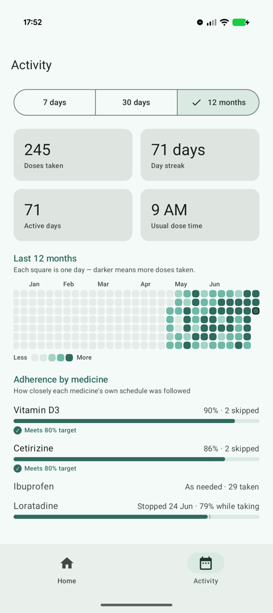
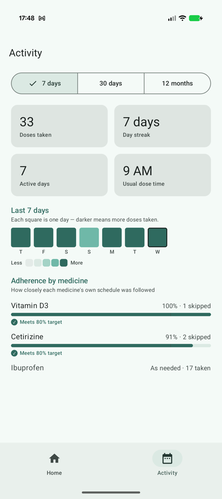

# HealthGuard

**Photograph a medication box → a vision LLM reads the label → a dosing
schedule, reminders-ready dose log, and honest adherence analytics.**

HealthGuard is a personal health-behaviour tracker for Android (Kotlin
Multiplatform). Its first module is medication tracking with a full
*recognize → structure → verify → act* pipeline — deliberately designed so
the AI only ever transcribes what is printed, and a human confirms every
uncertain field before anything is saved. Further modules — activity/running,
food and sleep tracking — are designed to feed the same activity history.

> **HealthGuard is an informational and reminder tool, not medical advice.**
> It never makes medical judgements. Always consult your doctor or pharmacist.

## Screenshots

| Home — today at a glance | Activity — 12-month record | Day detail |
|---|---|---|
|  |  |  |
| Due alert only when a dose is due; week circles with an honest "5 of 6 days on track"; per-row status (*Take* / *Taken ✓* / *Next in 2h 30m*); treatment-phase chips (*Not started*, *Stopped 24 Jun*) | GitHub-style contribution grid with month labels; stat tiles; per-medicine adherence with the clinical 80% target tick, *as-needed* and *stopped* rows | Tap any day square: which medicines, how many doses, at what times — including *expected but not recorded* |

| Activity — 7-day view | Medication detail | Dose history |
|---|---|---|
|  |  |  |
| The range chips re-render the whole tab — grid, tiles and adherence all describe one window | Per-second countdown, last-taken time, meal-aligned dose times, five-state completeness map (*All taken · Some · Not taken · Skipped · Not tracking*) | Every dose annotated: *on time*, *N min late*, *Skipped*, *Missed*, *Not recorded* |

## The pipeline

```
┌──────────────┐  photo (base64)  ┌────────────────┐  forced JSON schema  ┌────────────┐
│  Android app │ ───────────────► │  Ktor backend  │ ───────────────────► │ OpenRouter │
│  (Compose)   │ ◄─────────────── │  (proxy, holds │ ◄─────────────────── │  Qwen VL   │
└──────────────┘  extraction JSON │   the API key) │                      └────────────┘
```

1. **Capture** — camera or gallery; the image is downscaled and compressed
   on-device before upload.
2. **Extract** — the backend forwards the photo to a vision LLM
   (`qwen/qwen2.5-vl-72b-instruct` via OpenRouter, swappable by config) with a
   **forced JSON schema** (structured outputs): drug name, dosage, form,
   active ingredients, frequency, with-food — each wrapped with a
   self-reported confidence score.
3. **Verify** — the app validates the response against the schema through a
   boundary-safe parser that *never throws on malformed model output*, then
   applies **confidence gating**: every field below the threshold is flagged
   and must be confirmed or corrected by the user before Accept unlocks.
4. **Act** — accepted medications get meal-aligned dose schedules (nothing
   between 22:00 and 08:00), one-tap dose logging with undo and a
   double-dose guard, and adherence analytics measured against the schedule.

### Why the LLM never makes medical decisions

The model's only job is transcription. It cannot invent dosing advice
(the extraction prompt forbids inference), it cannot silently save uncertain
data (confidence gating), and it cannot crash or corrupt the app with
malformed output (the parser treats the model as an untrusted input source —
NaN confidence values, absurd frequencies like "3,000,000 times a day", and
garbage JSON all degrade to *needs review* instead of propagating).
Safety-relevant behaviour — dose timing, double-dose warnings, adherence
maths — is deterministic, unit-tested Kotlin.

## Architecture

| Module | What it is |
|---|---|
| `app/` | Android app — Jetpack Compose (Material 3, custom brand theme), Koin DI, MVVM with unidirectional state |
| `shared/` | Kotlin Multiplatform library — extraction parsing, dose-schedule domain logic, SQLDelight persistence. Android + JVM targets today, structured to add iOS |
| `backend/server/` | Ktor server — `POST /extract` forwards a label photo to the vision model with a strict JSON schema; the API key lives only here |

Clean-architecture layering inside the shared module: pure domain functions
(`nextDose`, `expectedDoseTimes`, adherence maths — all clock-injected and
timezone-explicit, with DST transition tests), a repository over SQLDelight,
and Ktor networking behind a swappable `VisionExtractor` interface.

### Adherence, done the way clinicians measure it

Percentages are computed against the **schedule**, not the log book — days
with no records count as gaps instead of silently vanishing. The model
follows the clinical **ABC taxonomy** (initiation / implementation /
persistence): medicines that were never started are labelled *Not started*
rather than polluting adherence stats, stopped treatments report *"% while
taking"*, deliberate skips are excluded from the target and shown separately,
and the **80% threshold** used in adherence research is marked directly on
every medicine's bar. "Every N hours" labels state a maximum, not an
obligation — those medicines are tracked *as-needed* instead of being
penalised for phantom around-the-clock doses.

## Engineering practices

- **300+ tests** across all three modules, written test-first: parser
  boundary tests (malformed JSON, hostile confidence values), dose-time
  maths across DST transitions and exotic timezones, ViewModels tested
  against a real in-memory database rather than mocks, deterministic
  seeded demo data with pinned expected values.
- **CI** (GitHub Actions): every push runs all test suites, Android Lint and
  an APK assembly.
- **Privacy by design**: health data never leaves the device; label photos
  pass through the backend to the model provider for extraction only and are
  never stored or logged; deleting a medication erases its entire history
  (right to erasure); release builds block all cleartext traffic.

## Prerequisites

- **JDK 21** (the build pins the Gradle daemon toolchain to 21; bytecode targets 17)
- **Android Studio** (latest stable) with an emulator image or a physical Android device (Android 7.0+, API 24)
- An **OpenRouter API key** — sign up at [openrouter.ai](https://openrouter.ai), create a key under *Keys*, and add a small amount of credit. A label scan with the default model (`qwen/qwen2.5-vl-72b-instruct`) costs a fraction of a cent. Setting a monthly spend limit on the key is recommended.

## 1. Start the backend server

The app cannot extract anything without the backend running.

Create `backend/server/.env` (git-ignored) containing your key:

```
OPENROUTER_API_KEY=sk-or-v1-...
```

The `run` task loads that file automatically, so starting the server is just:

```bash
./gradlew :backend:server:run
```

**From Android Studio instead of a terminal:** open the Gradle tool window
(the elephant icon, right edge) → `HealthGuard → backend → server → Tasks →
application → run` and double-click it. Android Studio adds it to the run
configuration dropdown next to ▶, so from then on you can start the backend
with the Run button and stop it with the red ■ — no terminal needed. (A
ready-made "backend server" run configuration may already appear in the
dropdown after a project reload.)

An environment variable still wins over `.env` if you prefer:
`OPENROUTER_API_KEY=sk-or-v1-... ./gradlew :backend:server:run`

**Stopping the server:**

- Started from Android Studio → press the red ■ stop button.
- Started from a terminal → `Ctrl-C` in that terminal.
- Lost track of it (e.g. a closed terminal left it running) →
  `lsof -ti :8787 | xargs kill`

Only one instance can hold port 8787 — if a start fails with
`Address already in use`, stop the previous instance first.

Success looks like:

```
INFO io.ktor.server.Application -- Application started ...
```

The server listens on **port 8787** and keeps running until you press `Ctrl-C`.
Optional environment variables: `PORT` (default 8787), `MODEL_ID` (default
`qwen/qwen2.5-vl-72b-instruct` — any vision-capable OpenRouter model id works).

**"Address already in use"?** A previous server instance is still holding the
port. Free it and start again:

```bash
lsof -ti :8787 | xargs kill
```

Quick health check (404 is the expected answer for the root path):

```bash
curl -i http://localhost:8787/
```

## 2. Run the app

Open the project in Android Studio, let Gradle sync, and pick **one** of the
three setups below depending on where the app will run. The app finds the
backend through one line in `local.properties` (a git-ignored file in the
repository root that Android Studio creates automatically).

### Option A — Emulator (zero configuration)

Nothing to configure. Inside an emulator, the special address `10.0.2.2`
means "the host machine", and that is the debug build's default.

1. Start the backend (step 1).
2. Select an emulator and press **Run ▶**.

### Option B — Real device over USB

The phone reaches your computer through an adb port tunnel — works even
without Wi-Fi.

1. Enable *Developer options* → *USB debugging* on the phone and plug it in.
2. Add this line to `local.properties`:

   ```properties
   healthguard.proxyBaseUrl=http://127.0.0.1:8787
   ```

3. Create the tunnel (re-run this any time the phone is re-plugged, rebooted,
   or adb restarts — it drops silently):

   ```bash
   adb reverse tcp:8787 tcp:8787
   ```

4. Start the backend (step 1), select the device, press **Run ▶**.

### Option C — Real device over Wi-Fi

The phone talks to your computer directly; both must be on the **same
Wi-Fi network**.

1. Find your computer's LAN IP:
   - macOS: `ipconfig getifaddr en0`
   - Linux: `hostname -I`
   - Windows: `ipconfig` (IPv4 address)
2. Add it to `local.properties`:

   ```properties
   healthguard.proxyBaseUrl=http://192.168.1.42:8787   # use YOUR IP
   ```

3. Start the backend (step 1), select the device, press **Run ▶**.
4. If your OS firewall prompts about incoming connections for Java, allow it.

Note: routers reassign IPs from time to time — if extraction stops working
after a few days, re-check the IP and update `local.properties`.

> Debug builds allow plain-HTTP traffic so these local setups work; release
> builds block cleartext entirely and expect an HTTPS backend URL.

## 3. Try the flow

1. **Import medication** → *Take photo* or *Choose from gallery* → aim at a
   medication box or label.
2. Watch *Reading label…* — the photo goes through the backend to the vision
   model.
3. The review dialog shows the extracted fields. Anything the model was not
   confident about is highlighted and must be confirmed or corrected before
   **Accept** unlocks. Add an optional label (e.g. *hay fever*) if you like.
4. Accept — the medication appears in the home list.
5. Press **▶** on a cabinet row to mark it as actively taking; it moves up
   into *Taking now* with its next dose on the row. Open a medication for
   the full detail page — take a dose, stop taking, or delete it there.

No backend running? The app degrades gracefully to
*"Service unavailable — check connection"* with a Retry button.

**How adherence is measured:** percentages compare doses you took against
what the schedule expected — so days with no records count as gaps rather
than disappearing from the maths. Doses you deliberately skip are left out
of the target and shown separately. "Every N hours" medicines have no fixed
daily target (labels state a maximum, not an obligation), so they are shown
as *as-needed* counts instead of a percentage. The 80% guideline mirrors the
threshold commonly used in clinical adherence research.

## Running the tests

```bash
./gradlew :shared:jvmTest            # parser, repository, dose calculator
./gradlew :app:testDebugUnitTest     # view models (against a real in-memory DB)
./gradlew :backend:server:test       # proxy contract tests (stubbed upstream)
```

CI (GitHub Actions) runs all of the above plus lint and an APK assembly on
every push.

## Troubleshooting

| Symptom | Likely cause → fix |
|---|---|
| *Service unavailable — check connection* | Backend not running → step 1. USB: tunnel dropped → `adb reverse tcp:8787 tcp:8787`. Wi-Fi: phone on mobile data or wrong network → join the same Wi-Fi; IP changed → update `local.properties` and rebuild |
| `Address already in use` when starting the server | `lsof -ti :8787 \| xargs kill`, then start again |
| Extraction returns *Couldn't read the label* | Blurry/dark photo → retake with the label flat and filling the frame |
| Server logs `502` / app can't extract despite server running | OpenRouter key invalid or out of credit → check [openrouter.ai/activity](https://openrouter.ai/activity) |
| Every field is flagged for review | Working as designed on hard labels — confirm or correct the fields; the app never trusts low-confidence output silently |
| Gradle sync/build errors about JVM versions | Use JDK 21 (Android Studio: *Settings → Build Tools → Gradle → Gradle JDK*) |

## Privacy & data handling

- Health data stays **on the device**; there is no account and no cloud sync.
- Label photos are sent to the backend and forwarded to the model provider
  for extraction only — the backend never stores or logs them.
- The backend never echoes provider errors (or anything containing the API
  key) to clients.
- Delete removes the medication and its entire dose history (right to
  erasure by design).
